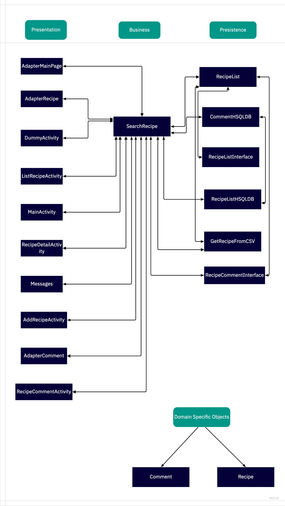

 # ARCHITECTURE.md

## SearchRecipe.java
This file inplements the all different types of search, like search by Ingredients or by category or by name.

## Recipe.java
Recipe.java is the object file which contains all the basic information of Recipe.

## Comment.java
Comment.java is the object file which contain the comments all basic informaiton of comment table.

## GetRecipeFromCVS.java
This file load all the information about recipes and ingredients of recipes form CSV files.

## Recipelist
This file manages the recipe objects in list by simply adding or removing recipes from csv and fake database.

## RecipeListInterface.java
RecipeListInterface.java is the interface of recipelist class and have signature of all the required methods.

## RecipeListHSQLDB.java
RecipeListHSQLDB.java is used to add recipes with detail or remove recipes form database.

## CommentHSQLDB.java
CommentHSQLDB.java is used to add/remove the content form comment table in database.

## AdapterMainPage.java
This file implements the home page GUI of this application.

## AdapterRecipe.java
This file implements second page GUI according to category, and s all the recipes according to the category. 

## DummyActivity.java
DummyActivity.java is used for testing in AndroidTest.

## ListRecipeActivity.java
ListRecipeActivity.java is used to list all recipes according to category on second page.

## MainActivity.java
MainActivity.java is used for all the widgets on main page.

## RecipeDetailActivity.java
RecipeDetailActivity is for recipe Ingredients and instrucitons. It will be implemented in Iteration2.

## AddRecipeActivity.java
AddRecipeActivity.java is java file used to have GUI for page where user can add new recipe to database.

## GUI templates

[templates](https://code.cs.umanitoba.ca/winter-2022-a02/group-10/irecipe/-/issues/28) Used for designing pages
