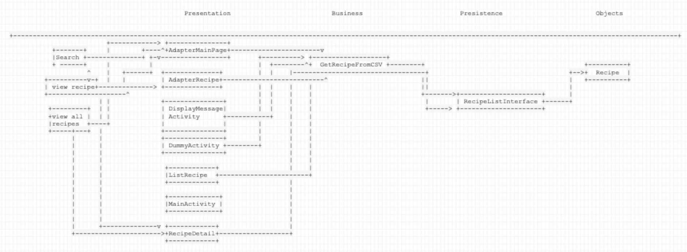

# ARCHITECTURE.md

## GetRecipeFromCVS.java 
It is the main class where all the features like addRecipe, removeRecipe, searchByName, getAllRecipes, getRecipesbyCategory and searchByIngredients are implemented.It makes a Arraylist for fake database by making object of Recipelist java file  and read all the data from a csv file line by line, till end of file.

## RecipeListInterface.java
RecipeListInterface.java is the interface of recipelist class and have signature of all the required methods

## AdapterMainPage.java
This file implements the home page GUI of this application.

## AdapterRecipe.java
This file implements second page GUI according to category, and s all the recipes according to the category. 

## Dessert.java

## Drink.java

## DummyActivity.java

## ListRecipe.java

## MainActivity.java

## MainDish.java

## RecipeDetail.java

## Soup.java

