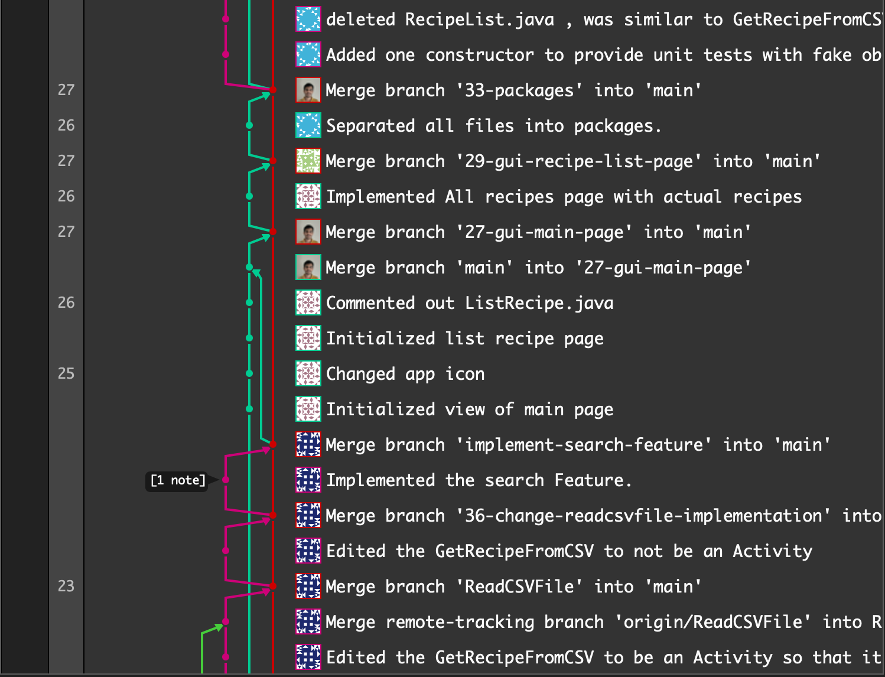

#  Branching Strategy
Our group is using git flow for the branching strategy. We have one main branch: main. All branches made by group members are created through the issues assigned to them. As members continue to work, they commit the changes to their respective branches. At the end of the iteration, respective branches are merged into the main branch which is then ready for release.

